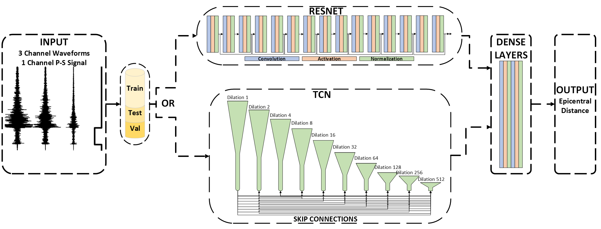

# MAGE
The computer code used for the experiments conducted in this work is named as MAGE after Middle East Technical University (METU), Graduate School of Informatics Applied Intelligence Research Laboratory (AIRLab), Geoinformatics and Artificial Intelligence Applications Group (GAIA), Epicenter distance estimation with deep learning.




## Introduction
MAGE is a software to develop deep learning based epicenter distance estimation models. Training and evaluating different models within the MAGE framework is possible.


## Setup
Download or pull/fork from the Git repository and setup the required libraries as stated in the requirements.txt file. The code to install all requirements is as follows: 


```bash
pip -install -r requirements.txt
```
After installing all requirements, the code should be able to run with no errors as detailed in the usage section.


## Usage

The usage requires some adjusts for the code so that the data, working directory and the output directory is clearly indicated in the code. To be able to do this, change the variables according to the directories of datasets, AFAD, STEAD or KANDILLI. Note that the experiments and evaluation are done with STEAD path thus it is not recommended to use KANDILLI and AFAD datasets, which requires different process than our baseline STEAD dataset. Selecting STEAD as described in the arguments section, will disable all other datasets and their corresponding affects.

The user can extract the accompanied test set (a very small portion of STEAD) into a folder and point the following directories to that folder to test the pipeline end-to-end. The first run will generate an attributes file that will be used in subsequent runs. If the user wants to test the whole STEAD set, then the created attributes file has to be deleted before running the code again with the same arguments.

```python
if args.pc:
    working_directory = "WORKDIR"
    AFAD_Path = "AFADDIR"
    STEAD_Path = "STEADDIR"
    KANDILLI_Path = "KANDILLIDIR"
else:
    working_directory = "WORKDIR"
    AFAD_Path = "AFADDIR"
    STEAD_Path = "STEADDIR"
    KANDILLI_Path = "KANDILLIDIR"
```


Experiments conducted with this code for our work can be followed through the [WANDB Link](https://api.wandb.ai/links/caglarmert/rdvjvsyu).
We have used the publicly available dataset, STEAD, STanford EArthquake Dataset (STEAD):A Global Data Set of Seismic Signals for AI. To reach the dataset follow this [link](https://github.com/smousavi05/STEAD).

## Arguments Explanation

This document provides an explanation of the various command-line arguments used in the program along with their default values and possible options.

### Boolean Arguments:
- `--wandb`: If specified, enables the use of WandB. Default: `True`.
- `--test`: If specified, enables test mode. Default: `False`.
- `--pc`: If specified, enables the use of PC. Default: `True`.
- `--Transfer_model`: If specified, enables transfer learning for the model. Default: `False`.
- `--Transfer_encoder`: If specified, enables transfer learning for the encoder. Default: `False`.
- `--add_stat_info`: If specified, adds statistical information. Default: `True`.
- `--add_station_altitude`: If specified, adds station altitude information. Default: `True`.
- `--gtnorm`: If specified, enables ground truth normalization. Default: `False`.
- `--SP`: If specified, performs signal processing. Default: `False`.
- `--augmentation_flag`: If specified, enables data augmentation. Default: `True`.
- `--freqtime`: If specified, considers frequency over time. Default: `False`.

### Numeric Arguments:
- `--fno`: Number of features. Default: `1`.
- `--fsiz`: Feature size. Default: `4`.
- `--batchsize`: Batch size. Default: `64`.
- `--n_epochs`: Number of epochs. Default: `100`.
- `--step_size`: Step size. Default: `20`.
- `--gamma`: Gamma value. Default: `0.9`.
- `--FC_size`: Fully connected layer size. Default: `256`.
- `--radius`: Radius value. Default: `300`.
- `--magnitude`: Magnitude value. Default: `3.5`.
- `--depth`: Depth value. Default: `10000`.
- `--stat_dist`: Station distance. Default: `120`.
- `--train_percentage`: Training percentage. Default: `80`.
- `--augmentation_parameter`: Augmentation parameter. Default: `1`.
- `--fs`: Frequency. Default: `100`.
- `--window_size`: Window size. Default: `1`.
- `--signaltime`: Signal time. Default: `60`.
- `--lr`: Learning rate. Default: `0.0001`.
- `--dropout`: Dropout rate. Default: `0.1`.

### String Arguments:
- `--gt_select`: Ground truth selection. Default: `["Distance"]`.
- `--dataset`: Dataset name. Default: `"STEAD"`.
- `--crossvalidation_type`: Cross-validation type. Default: `"Chronological"`.
- `--loss_function`: Loss function type. Default: `"MAE"`.
- `--network`: Network architecture. Default: `"TCN"`.

### Floating-point Arguments:
- `--signal_aug_rate`: Signal augmentation rate. Default: `0.3`.

### Location Arguments:
- `--lat`: Latitude. Default: `36.77`.
- `--lon`: Longitude. Default: `-119.41`.

### Notes:
- Use appropriate flags to enable or disable specific features according to your requirements.
- Adjust numeric values as needed based on the specifics of your dataset and model architecture.

Please refer to the documentation or source code for further details on each argument's usage and functionality.

## Example Usage

You can use the experiment.py (the main of this code) and select the following arguments (or their defaults will be used). The following code starts an experiment with number of epochs as 200, with P-S phase information, fully connected layer size as 256, learning rate as 0.001, network architecture as TCN and only considers stations within a radius of 300 KM of the default location `--lat`: Latitude. Default: `36.77` `--lon`: Longitude. Default: `-119.41`.

```bash
src/experiment.py --radius 300 --n_epochs 200 --SP --FC_size 256 --lr 0.001 --network TCN
```

The code above will create a .pkl file that will be named: "hat_STEAD_lt_36_ln_-119_rd_300_dr_60_ed_120_sp_1fr0_c_C.pkl". This file is basically the attributes pickle that speeds up the subsequent runs.

## Test

The following code can be run to test the pipeline. Basically, the code will be run for the stations within 300 KM radius (just as we did before) but the training will last much shorter as we will provide number of epochs 2 and a much smaller model dimension (64). TCN network trains faster than ResNet. Evaluation and the results will be saved just like a normal run.

```bash
src/experiment.py --radius 300 --n_epochs 2 --FC_size 64 --lr 0.001 --network TCN
```


## Contact Information
Ümit Mert Çağlar

Middle East Technical University

Graduate School of Informatics

mert[dot]caglar[at]metu.edu.tr
